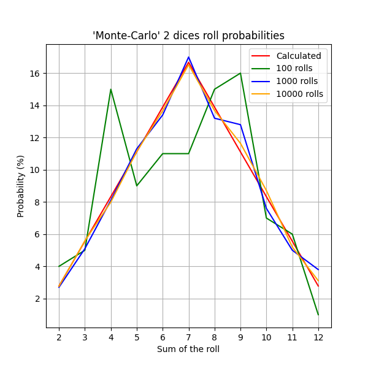

# Завдання 7. Використання методу Монте-Карло для симуляції кидків 2-х кубиків

## Опис виконаного завдання

- Аналітичні ймовірності `PROBABILITIES` представляють теоретичну можливість випадання кожної суми при кидку двох кубиків, базуючись на комбінаторному аналізі.

- Метод Монте-Карло `monte_carlo` виконує симуляцію кидків кубиків. Зі збільшенням кількості кидків (100, 1000, 10000), результати Монте-Карло наближаються до аналітичних ймовірностей.

## Висновок

Графік відображає, наскільки симуляції Монте-Карло відповідають аналітичним ймовірностям зі зростанням кількості випробувань, демонструючи надійність симуляцій Монте-Карло для ймовірнісного аналізу. Також, треба зазначити ефективність методу Монте-Карло у наближенні ймовірностей випадкових подій, особливо коли аналітичні розв'язки є складними, хоча в даному випадку це не є важливим, через простоту проблеми.